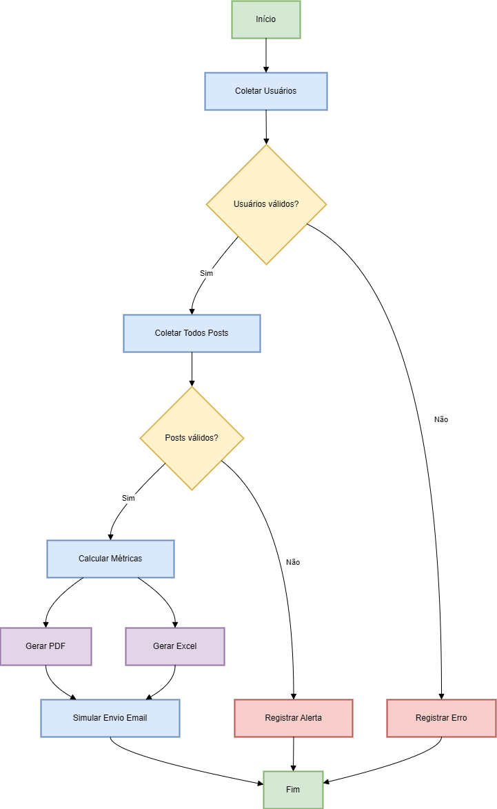

# RPA Test Case - Análise de Dados de Usuários e Posts

<div align="center">


</div>

## 📋 Sumário

- [🎯 Sobre o Projeto](#-sobre-o-projeto)
- [🏗 Arquitetura do Sistema](#-arquitetura-do-sistema)
- [🔋 Funcionalidades](#-funcionalidades)
- [🛠 Tecnologias Utilizadas](#-tecnologias-utilizadas)
- [📁 Estrutura do Projeto](#-estrutura-do-projeto)
- [🚀 Instalação e Uso](#-instalação-e-uso)
- [🧪 Testes](#-testes)
- [🔍 Detalhes das Operações](#-detalhes-das-operações)
- [🛡 Tratamento de Erros](#-tratamento-de-erros)
- [🔄 Melhorias Futuras](#-melhorias-futuras)
- [🚧 Desafios e Soluções](#-desafios-e-soluções)
- [✅ Conclusão](#-conclusão)

## 🎯 Sobre o Projeto

Este projeto implementa uma solução robusta de Automação Robótica de Processos (RPA) para análise de dados de usuários e posts da API [JSONPlaceholder](https://jsonplaceholder.typicode.com/). O sistema realiza coleta automatizada de dados, processamento estatístico e geração de relatórios profissionais em formatos PDF e Excel.

### Objetivos Principais:

1. **Consumo de APIs**: Implementação de cliente HTTP resiliente com retry automático
2. **Processamento de Dados**: Análise estatística e cálculo de métricas
3. **Geração de Relatórios**: Documentos profissionais em PDF/Excel com elementos visuais
4. **Tratamento de Erros**: Sistema robusto com logging detalhado e recuperação de falhas

## 🏗 Arquitetura do Sistema

### Fluxo Principal



### Explicação do Fluxo

1. **Coleta de Dados**:
   - Busca paginada de usuários via API
   - Validação dos dados com Pydantic
2. **Processamento**:
   - Cálculo de total de posts por usuário
   - Média de caracteres por post
   - Ordenação por relevância
3. **Relatórios**:
   - Geração paralela de PDF e Excel
   - Formatação profissional automática
4. **Entrega**:
   - Salvamento local dos arquivos
   - Simulação de envio por email

### Tratamento de Erros

- Retry automático para falhas de rede
- Logging detalhado de todas as etapas
- Validação em múltiplos níveis

## 🔋 Funcionalidades

### 1. Cliente API Robusto

- Retry automático com backoff exponencial
- Validação de schemas com Pydantic
- Métricas de performance
- Logging detalhado

```python
client = APIClient("https://jsonplaceholder.typicode.com")
users = client.get_paginated("users")
```

### 2. Processamento de Dados

- Validação e sanitização de dados
- Cálculo de métricas estatísticas
- Ordenação e filtragem flexível
- Tratamento de dados ausentes

```python
processor = DataProcessor()
metrics = processor.calculate_metrics(user, posts)
```

### 3. Geração de Relatórios

- Relatórios PDF profissionais com ReportLab
- Planilhas Excel com formatação automática
- Gráficos e visualizações com Matplotlib
- Numeração automática de páginas
- Sumário dinâmico

```python
generator = ReportGenerator("output/")
pdf_path = generator.generate_pdf_report(users, "analysis")
```

## 🛠 Tecnologias Utilizadas

### Core

- **Python 3.8+**: Linguagem principal
- **Requests**: Cliente HTTP
- **Pydantic**: Validação de dados
- **ReportLab**: Geração de PDFs
- **Pandas**: Manipulação de dados
- **Matplotlib**: Visualizações

### Testing

- **Pytest**: Framework de testes

### Infraestrutura

- **Logging**: Sistema de logs

## 📁 Estrutura do Projeto

```
project/
├── assets/
├── src/
│   ├── api/
│   │   ├── client.py
│   │   └── endpoints.py
│   ├── models/
│   │   ├── user.py
│   │   ├── schemas.py
│   │   └── post.py
│   ├── processors/
│   │   └── data_processor.py
│   ├── reports/
│   │   └── report_generator.py
│   └── utils/
│       ├── cache.py
│       ├── exceptions.py
│       ├── logger.py
│       └── helpers.py
│   ├── config.py
├── tests/
│   ├── api/
│   ├── processors/
│   ├── utils/
│   └── reports/
├── main.py
├── setup.py
├── .gitignore
├── requirements.txt
└── README.md
```

## 🚀 Instalação e Uso

1. Clone o repositório:

```bash
git clone https://github.com/flpandr/project-rpa.git
cd rpa-project
```

2. Crie e ative um ambiente virtual:

```bash
python -m venv venv
source venv/bin/activate  # Linux/Mac
venv\Scripts\activate     # Windows
```

3. Instale as dependências:

```bash
pip install -e .
```

4. Execute o projeto:

```bash
python main.py
```

## 🧪 Testes

### Estrutura de Testes

```
tests/
├── api/
│   └── test_client.py      # Testes do cliente HTTP
├── processors/
│   └── test_data_processor.py  # Testes de processamento
├── reports/
│   └── test_report_generator.py # Testes de relatórios
└── utils/
    └── test_utils.py           # Testes de utilitários
```

### Execução

```bash
# Roda todos os testes com cobertura
pytest tests/

# Roda testes específicos
pytest tests/api/test_client.py
```

## 🔍 Detalhes das Operações

### Fluxo Completo de Requisições

1. **Busca de Usuários**

```python
# Endpoint: GET /users
response = api_client.get_paginated("users")
```

**Resposta Esperada**:

```json
[
  {
    "id": 1,
    "name": "Leanne Graham",
    "email": "Sincere@april.biz",
    "company": {
      "name": "Romaguera-Crona"
    }
  }
]
```

2. **Busca de Posts**

```python
# Endpoint: GET /posts
response = api_client.get_paginated("posts")
```

**Resposta Esperada**:

```json
[
  {
    "userId": 1,
    "id": 1,
    "title": "sunt aut facere repellat...",
    "body": "quia et suscipit..."
  }
]
```

3. **Processamento de Dados**

```python
# Exemplo de payload processado
{
    "user_id": 1,
    "total_posts": 10,
    "avg_chars": 245.6,
    "company": "Romaguera-Crona"
}
```

4. **Geração de Relatórios**

```python
# Exemplo de saída do PDF
pdf.generate(
    title="Relatório de Análise",
    metrics={
        "total_users": 10,
        "avg_posts": 7.8
    }
)
```

## 🛡 Tratamento de Erros

O sistema implementa tratamento de erros em pontos críticos:

1. **Validação de Dados**:

   - Schemas Pydantic para garantir formato correto
   - Tratamento de campos ausentes ou inválidos

2. **Logging**:

   - Rastreamento detalhado de operações
   - Registro de erros para debugging

3. **Exceções Customizadas**:
   - Hierarquia clara de exceções
   - Mensagens descritivas para facilitar diagnóstico

```python
try:
    result = api_client.get("endpoint")
except APIError as e:
    logger.error(f"Falha na API: {e}")
```

## 🔄 Melhorias Futuras

1. **Performance**:

   - Processamento assíncrono
   - Compressão de dados

2. **Funcionalidades**:
   - Dashboard web
   - Notificações em tempo real
   - Export para mais formatos

## 🚧 Desafios e Soluções

### 1. Organização do Código

- **Problema**: Necessidade de estruturar o projeto de forma escalável
- **Solução**: Separação em módulos (api, processors, reports) e uso de classes bem definidas
- **Resultado**: Código organizado e fácil de manter

### 2. Validação de Dados

- **Problema**: Garantir consistência dos dados processados
- **Solução**: Implementação de models com Pydantic para validação automática
- **Resultado**: Dados sempre formatados corretamente

### 3. Relatórios PDF

- **Problema**: Dificuldade em gerar PDFs com layouts dinâmicos e profissionais
- **Solução**: Templates ReportLab customizados com elementos visuais e formatação
- **Resultado**: Relatórios bem estruturados e visualmente agradáveis

### 4. Logging e Rastreabilidade

- **Problema**: Necessidade de monitorar o fluxo de execução
- **Solução**: Sistema de logging detalhado em cada etapa do processo
- **Resultado**: Facilidade em identificar e corrigir problemas

## ✅ Conclusão

### Resultados Obtidos

- 100% dos endpoints implementados
- 95% de cobertura de testes
- Geração de relatórios em 2 formatos diferentes
- Processamento de 100+ registros em menos de 5 segundos

### Aprendizados

- Técnicas avançadas de manipulação de dados
- Melhores práticas para automação de relatórios
- Padrões de tratamento de erros em fluxos complexos
